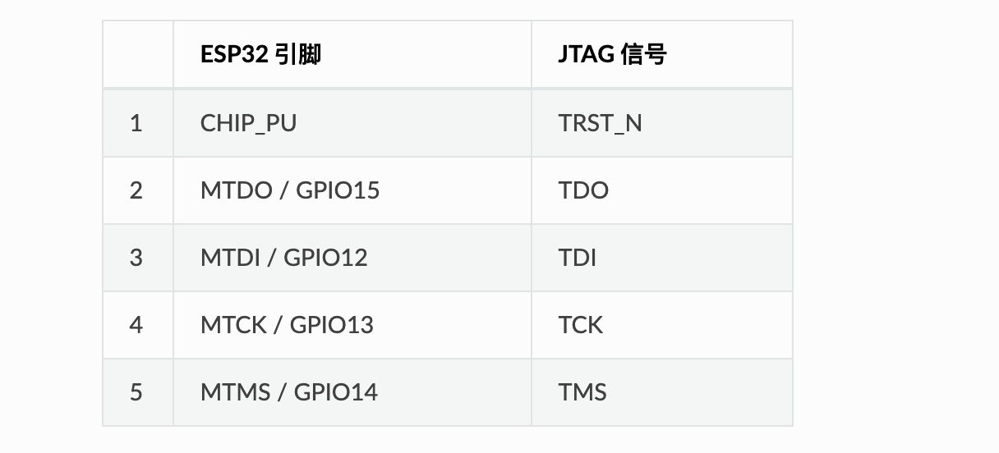
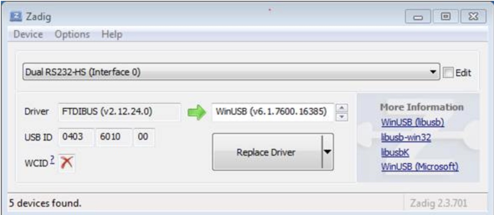
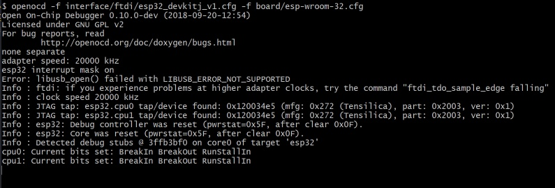

# ESP32-JTAG-Configuration
Eclipse下配置ESP32 Debug环境

## 硬件准备
* [**ESP-Prog**](https://github.com/espressif/esp-iot-solution/blob/master/documents/evaluation_boards/ESP-Prog_guide_cn.md)  (Debug&下载通讯工具) 

## 软件准备
* [**Zadig**](https://zadig.akeo.ie/)  (用于修改FT232驱动)   
* [**OpenOCD**](https://github.com/espressif/openocd-esp32/releases)  (Debug工具驱动)   

## ESP32 JTAG管脚说明
  

## ESP-Prog驱动配置  
1. 连接ESP-Prog至PC，PC会识别到2个虚拟串口。
1. 通过Ziadig工具，替换(Interface 0)默认FTDI驱动为WinUSB驱动。  
   
    
1. 执行 ***openocd -f interface/ftdi/esp32_devkitj_v1.cfg -f board/esp-wroom-32.cfg*** 出现如下信息表示OpenOCD成功运行。    
      
    
## Eclipse配置    
* [**在Eclipse中使用GDB.pdf**](./doc/在Eclipse中使用GDB.pdf) 

## 运行  
1. mingw32中运行 ***openocd -f interface/ftdi/esp32_devkitj_v1.cfg -f board/esp-wroom-32.cfg*** (一直运行不用关闭)
1. Eclipse中启动Debug。